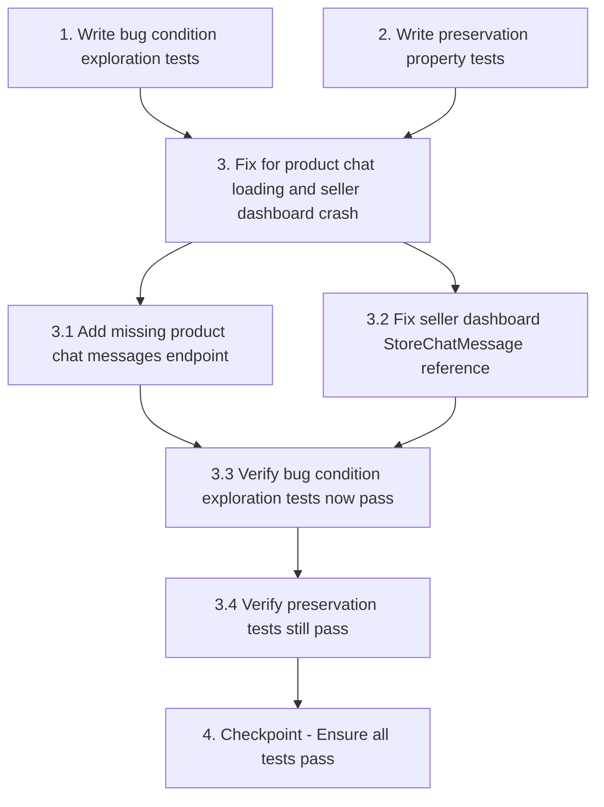

# Implementation Plan

## Overview

This implementation plan addresses two critical bugs in the chat system:
1. **Product chat screen loading issue**: Missing backend endpoint causes messages to not appear
2. **Seller dashboard crash**: Reference to removed `StoreChatMessage` model causes dashboard to fail

The plan follows the exploratory bugfix workflow: Explore → Preserve → Implement → Validate

---

## Tasks

- [ ] 1. Write bug condition exploration tests
  - **Property 1: Bug Condition** - Product Chat Messages Retrieval and Seller Dashboard Load
  - **CRITICAL**: These tests MUST FAIL on unfixed code - failure confirms the bugs exist
  - **DO NOT attempt to fix the tests or the code when they fail**
  - **NOTE**: These tests encode the expected behavior - they will validate the fixes when they pass after implementation
  - **GOAL**: Surface counterexamples that demonstrate the bugs exist
  - **Scoped PBT Approach**: For deterministic bugs, scope the property to the concrete failing cases to ensure reproducibility
  - Test implementation details from Bug Condition specifications in design:
    - **Bug 1**: Send POST to `/api/v1/chat/product/send` with valid `product_id` and `message`, then GET `/api/v1/chat/product/<product_id>/messages` (should fail with 404 on unfixed code)
    - **Bug 2**: Send GET to `/seller/dashboard` as authenticated seller (should fail with 500 NameError on unfixed code)
  - The test assertions should match the Expected Behavior Properties from design:
    - **Property 1 (Bug 1)**: For any API request to `/api/v1/chat/product/<product_id>/messages` with valid auth, SHALL return HTTP 200 with all ChatMessage records filtered by product_id and user pair, ordered by created_at ascending
    - **Property 2 (Bug 2)**: For any request to `seller_dashboard()` as authenticated seller, SHALL query unified ChatMessage model with receiver_id=seller_id and is_read=False, returning count without raising NameError or AttributeError
  - Run tests on UNFIXED code
  - **EXPECTED OUTCOME**: Tests FAIL (this is correct - it proves the bugs exist)
  - Document counterexamples found to understand root cause:
    - Expected: GET `/api/v1/chat/product/32/messages` returns 404 Not Found
    - Expected: GET `/seller/dashboard` returns 500 with `NameError: name 'StoreChatMessage' is not defined`
  - Mark task complete when tests are written, run, and failures are documented
  - _Requirements: 1.1, 1.2, 1.3, 1.4, 1.5, 1.6_

- [ ] 2. Write preservation property tests (BEFORE implementing fix)
  - **Property 2: Preservation** - Non-Product Chat and Dashboard Statistics
  - **IMPORTANT**: Follow observation-first methodology
  - Observe behavior on UNFIXED code for non-buggy inputs:
    - **Non-Product Chat**: Send POST to `/api/v1/chat/send` (without product_id), observe it works correctly
    - **Conversation List**: GET `/api/v1/chat/conversations`, observe all conversations display correctly
    - **User-to-User Messages**: GET `/api/v1/chat/messages/<other_user_id>`, observe all messages return correctly
    - **Dashboard Statistics**: GET `/seller/dashboard` for seller with no unread messages, observe statistics calculate correctly
  - Write property-based tests capturing observed behavior patterns from Preservation Requirements:
    - **Property 3**: For any chat message sent via `/api/v1/chat/send` (non-product) or retrieved via `/api/v1/chat/messages/<other_user_id>`, SHALL produce exactly the same behavior as original code
    - **Property 4**: For any request to `seller_dashboard()`, SHALL calculate all statistics (total products, orders, sales, performance, transactions, revenue) exactly as before
  - Property-based testing generates many test cases for stronger guarantees
  - Run tests on UNFIXED code
  - **EXPECTED OUTCOME**: Tests PASS (this confirms baseline behavior to preserve)
  - Mark task complete when tests are written, run, and passing on unfixed code
  - _Requirements: 3.1, 3.2, 3.3, 3.4, 3.5, 3.6, 3.7, 3.8_

- [ ] 3. Fix for product chat loading and seller dashboard crash

  - [ ] 3.1 Add missing product chat messages endpoint to unified_chat_api.py
    - Create new route `/api/v1/chat/product/<int:product_id>/messages` with GET method
    - Query Product table to get seller_id for the given product_id
    - Query ChatMessage table filtering by:
      - `product_id == product_id`
      - `(sender_id == current_user_id AND receiver_id == seller_id) OR (sender_id == seller_id AND receiver_id == current_user_id)`
    - Order results by `created_at` ascending
    - Mark messages as read where `sender_id == seller_id AND receiver_id == current_user_id AND is_read == False`
    - Return JSON response with `success: true`, `messages: [...]` array containing:
      - Message fields: `id`, `sender_id`, `receiver_id`, `message`, `product_id`, `is_read`, `created_at`
      - Sender info: `sender.name`, `sender.role`, `sender.profile_picture`
    - Handle edge cases:
      - Product not found: return 404 with error message
      - User not authenticated: return 401 with error message
      - No messages found: return empty messages array with success: true
    - _Bug_Condition: isBugCondition_ProductChat(input) where input.action == 'get_product_messages' AND input.endpoint == '/api/v1/chat/product/<productId>/messages' AND NOT endpointExists(input.endpoint)_
    - _Expected_Behavior: For any API request to `/api/v1/chat/product/<product_id>/messages` with valid auth, SHALL return HTTP 200 with all ChatMessage records filtered by product_id and user pair, ordered by created_at ascending (Property 1 from design)_
    - _Preservation: Non-product chat messages sent via `/api/v1/chat/send` must continue to work exactly as before (Property 3 from design)_
    - _Requirements: 2.1, 2.2, 2.3, 2.4, 2.5, 2.6, 2.7, 2.8, 2.9_

  - [ ] 3.2 Fix seller dashboard StoreChatMessage reference in app.py
    - Locate line 8484 in `app.py` where `StoreChatMessage.query.filter_by(seller_id=seller_id, is_read=False, sender_role='buyer').count()` is called
    - Replace with unified ChatMessage model access pattern:
      - Use `ChatMessage = db.Model.registry._class_registry.get('ChatMessage')` to access the model
      - Change query to `ChatMessage.query.filter_by(receiver_id=seller_id, is_read=False).count()`
      - Note: Use `receiver_id` instead of `seller_id`, and remove `sender_role` filter (unified model doesn't have this field)
    - Add error handling with try-except block:
      - If `ChatMessage` is not registered, set `unread_chat_count = 0` as fallback
      - Log warning if model is not found
    - Search for other occurrences of `StoreChatMessage` in `app.py`:
      - Check lines 7756, 8746, 8796
      - Check `store_chat` routes around lines 12519-12660
      - Apply same pattern to ensure consistency
    - Verify no other references to `RiderChatMessage` exist (should already be migrated)
    - _Bug_Condition: isBugCondition_SellerDashboard(input) where input.route == 'seller_dashboard' AND input.line == 8484 AND input.model == 'StoreChatMessage' AND NOT modelExists('StoreChatMessage')_
    - _Expected_Behavior: For any request to seller_dashboard() as authenticated seller, SHALL query unified ChatMessage model with receiver_id=seller_id and is_read=False, returning count without raising NameError or AttributeError (Property 2 from design)_
    - _Preservation: Dashboard statistics (total products, orders, sales, performance, transactions, revenue) must calculate correctly exactly as before (Property 4 from design)_
    - _Requirements: 2.10, 2.11, 2.12_

  - [ ] 3.3 Verify bug condition exploration tests now pass
    - **Property 1: Expected Behavior** - Product Chat Messages Retrieval and Seller Dashboard Load
    - **IMPORTANT**: Re-run the SAME tests from task 1 - do NOT write new tests
    - The tests from task 1 encode the expected behavior
    - When these tests pass, it confirms the expected behavior is satisfied
    - Run bug condition exploration tests from step 1:
      - Test GET `/api/v1/chat/product/<product_id>/messages` returns 200 with messages array
      - Test GET `/seller/dashboard` returns 200 with unread_chat_count in context
    - **EXPECTED OUTCOME**: Tests PASS (confirms bugs are fixed)
    - Verify specific behaviors:
      - Product chat endpoint returns correct messages filtered by product_id
      - Messages are marked as read when retrieved
      - Seller dashboard loads without NameError
      - Unread chat count is calculated correctly
    - _Requirements: 2.1, 2.2, 2.3, 2.4, 2.5, 2.6, 2.7, 2.8, 2.9, 2.10, 2.11, 2.12_

  - [ ] 3.4 Verify preservation tests still pass
    - **Property 2: Preservation** - Non-Product Chat and Dashboard Statistics
    - **IMPORTANT**: Re-run the SAME tests from task 2 - do NOT write new tests
    - Run preservation property tests from step 2:
      - Test POST `/api/v1/chat/send` (non-product chat) still works
      - Test GET `/api/v1/chat/conversations` returns all conversations
      - Test GET `/api/v1/chat/messages/<other_user_id>` returns all messages
      - Test seller dashboard statistics calculate correctly
    - **EXPECTED OUTCOME**: Tests PASS (confirms no regressions)
    - Confirm all preservation requirements:
      - Regular chat messages work exactly as before
      - Conversation list displays all conversations correctly
      - User-to-user messages retrieve correctly
      - SocketIO events emit correctly
      - Dashboard statistics (products, orders, sales, performance, transactions, revenue) calculate exactly as before
    - _Requirements: 3.1, 3.2, 3.3, 3.4, 3.5, 3.6, 3.7, 3.8_

- [ ] 4. Checkpoint - Ensure all tests pass
  - Run all bug condition exploration tests (should pass)
  - Run all preservation property tests (should pass)
  - Verify no regressions in existing functionality
  - Test full product chat flow end-to-end:
    - Buyer sends message via `/api/v1/chat/product/send`
    - Buyer retrieves messages via `/api/v1/chat/product/<product_id>/messages`
    - Message appears in chat screen immediately
    - Message appears in conversation list immediately
  - Test full seller dashboard flow end-to-end:
    - Seller logs in and navigates to dashboard
    - Dashboard loads successfully with all statistics
    - Unread chat count displays correctly
  - If any issues arise, ask the user for guidance before proceeding

---

## Task Dependency Graph



```json
{
  "waves": [
    {
      "name": "Wave 1: Exploration and Preservation Tests",
      "tasks": ["1", "2"]
    },
    {
      "name": "Wave 2: Implementation",
      "tasks": ["3.1", "3.2"]
    },
    {
      "name": "Wave 3: Verification",
      "tasks": ["3.3", "3.4"]
    },
    {
      "name": "Wave 4: Final Checkpoint",
      "tasks": ["4"]
    }
  ]
}
```

**Dependency Explanation:**
- **Task 1** (Bug condition exploration tests) must be written BEFORE implementing fixes to confirm bugs exist
- **Task 2** (Preservation tests) must be written BEFORE implementing fixes to establish baseline behavior
- **Task 3.1** and **Task 3.2** can be implemented in parallel after exploration and preservation tests are written
- **Task 3.3** (Verify bug fixes) depends on both 3.1 and 3.2 being complete
- **Task 3.4** (Verify preservation) depends on 3.3 passing
- **Task 4** (Final checkpoint) depends on all previous tasks being complete

---

## Notes

- **Testing Framework**: Use pytest for backend tests. Tests should be placed in `backend/tests/` directory.
- **Test Files**: Create `test_product_chat_bug.py` for bug condition tests and `test_chat_preservation.py` for preservation tests.
- **Property-Based Testing**: Use `hypothesis` library for property-based tests to generate test cases automatically.
- **Authentication**: Tests requiring authentication should use test fixtures to create authenticated sessions.
- **Database State**: Use database transactions and rollbacks in tests to ensure clean state between test runs.
- **Mobile App Testing**: While backend tests verify API behavior, manual testing of the mobile app is recommended to confirm UI updates correctly.
- **SocketIO Events**: Preservation tests should verify that real-time events continue to emit correctly after fixes.
- **Error Handling**: Both fixes include proper error handling to prevent crashes if models are not registered or products are not found.
- **Code Search**: Before implementing 3.2, search entire `app.py` for all occurrences of `StoreChatMessage` and `RiderChatMessage` to ensure complete migration.
- **Backward Compatibility**: The new `/api/v1/chat/product/<product_id>/messages` endpoint is additive and does not modify existing endpoints.
