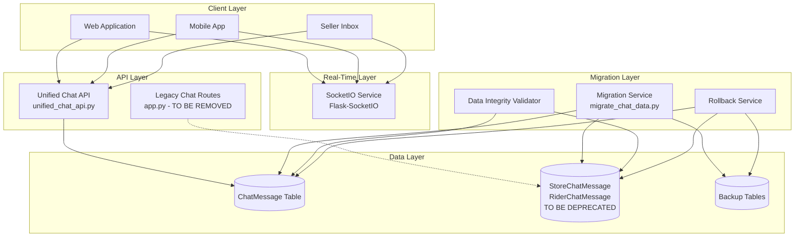
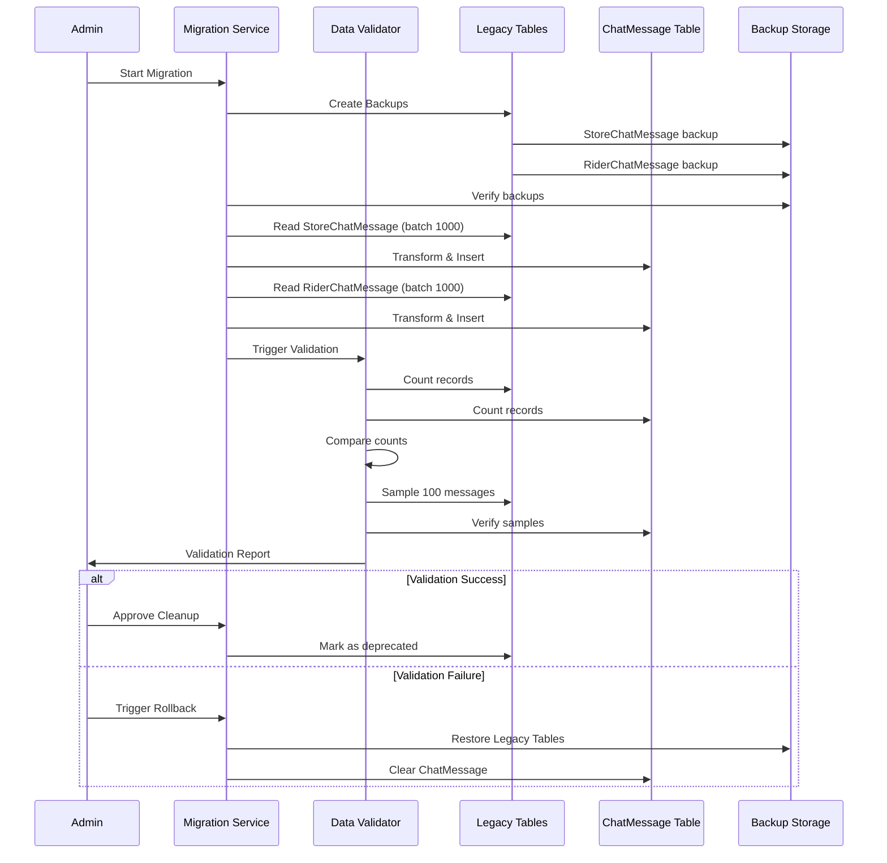

# Design Document: Unified Chat Migration

## Overview

This design document specifies the technical architecture for migrating from a legacy dual-table chat system (StoreChatMessage and RiderChatMessage) to a unified single-table architecture (ChatMessage). The migration consolidates all chat functionality into a maintainable, scalable system supporting buyer-seller product chats, buyer-rider order chats, and real-time messaging via SocketIO.

### Current State

The legacy system has two separate implementations:
- **StoreChatMessage**: Handles buyer ↔ seller conversations (app.py lines 2893-2906)
- **RiderChatMessage**: Handles buyer ↔ rider conversations (app.py lines 2908-2920)
- **Legacy Routes**: Seven chat endpoints in app.py (lines 7728-8012)

This dual-table approach causes:
- Code duplication and maintenance overhead
- Route conflicts between legacy and unified systems
- Inconsistent API behavior across user types
- Difficulty adding new chat features

### Target State

The unified system provides:
- **Single ChatMessage Table**: Stores all user-to-user conversations
- **Unified API**: Consistent endpoints for all chat operations
- **Real-Time Messaging**: SocketIO for instant message delivery
- **Product & Order Context**: Support for product-based and order-based chats
- **Mobile Compatibility**: RESTful API with JWT authentication
- **Zero Downtime**: Migration runs while system remains operational


## Architecture

### System Components




### Migration Flow




## Components and Interfaces

### 1. Migration Service

**Purpose**: Orchestrates the data migration from legacy tables to unified table.

**Key Responsibilities**:
- Create backups of legacy tables before migration
- Read records from StoreChatMessage and RiderChatMessage in batches
- Transform legacy records to unified ChatMessage format
- Handle errors gracefully with retry logic
- Log migration progress and statistics

**Interface**:

```python
class MigrationService:
    def __init__(self, db_session, batch_size=1000):
        """Initialize migration service with database session and batch size"""
        
    def create_backups(self) -> Dict[str, str]:
        """Create timestamped backups of legacy tables
        Returns: Dict with backup file paths
        """
        
    def migrate_store_chat_messages(self) -> MigrationResult:
        """Migrate all StoreChatMessage records to ChatMessage
        Returns: MigrationResult with success count, error count, errors list
        """
        
    def migrate_rider_chat_messages(self) -> MigrationResult:
        """Migrate all RiderChatMessage records to ChatMessage
        Returns: MigrationResult with success count, error count, errors list
        """
        
    def run_full_migration(self) -> FullMigrationResult:
        """Execute complete migration workflow
        Returns: FullMigrationResult with all statistics and validation status
        """
```


**Transformation Logic**:

```python
# StoreChatMessage → ChatMessage
def transform_store_chat_message(legacy_msg: StoreChatMessage) -> ChatMessage:
    """Transform StoreChatMessage to ChatMessage format"""
    if legacy_msg.sender_role == 'buyer':
        sender_id = legacy_msg.buyer_id
        receiver_id = legacy_msg.seller_id
    else:  # sender_role == 'seller'
        sender_id = legacy_msg.seller_id
        receiver_id = legacy_msg.buyer_id
    
    return ChatMessage(
        sender_id=sender_id,
        receiver_id=receiver_id,
        message=legacy_msg.message,
        product_id=legacy_msg.product_id,
        order_id=None,  # StoreChatMessage has no order_id
        is_read=legacy_msg.is_read,
        created_at=legacy_msg.created_at
    )

# RiderChatMessage → ChatMessage
def transform_rider_chat_message(legacy_msg: RiderChatMessage) -> ChatMessage:
    """Transform RiderChatMessage to ChatMessage format"""
    if legacy_msg.sender_role == 'buyer':
        sender_id = legacy_msg.buyer_id
        receiver_id = legacy_msg.rider_id
    else:  # sender_role == 'rider'
        sender_id = legacy_msg.rider_id
        receiver_id = legacy_msg.buyer_id
    
    return ChatMessage(
        sender_id=sender_id,
        receiver_id=receiver_id,
        message=legacy_msg.message,
        product_id=None,  # RiderChatMessage has no product_id
        order_id=legacy_msg.order_id,
        is_read=legacy_msg.is_read,
        created_at=legacy_msg.created_at
    )
```


### 2. Data Integrity Validator

**Purpose**: Verify that all data was migrated correctly without loss or corruption.

**Key Responsibilities**:
- Count records in legacy and unified tables
- Sample random messages and verify content matches
- Validate timestamps, is_read status, and foreign keys
- Generate detailed validation reports

**Interface**:

```python
class DataIntegrityValidator:
    def __init__(self, db_session):
        """Initialize validator with database session"""
        
    def count_legacy_records(self) -> Dict[str, int]:
        """Count records in StoreChatMessage and RiderChatMessage
        Returns: {'store_chat': count, 'rider_chat': count, 'total': count}
        """
        
    def count_unified_records(self) -> int:
        """Count records in ChatMessage table"""
        
    def validate_record_counts(self) -> bool:
        """Verify unified count equals sum of legacy counts"""
        
    def sample_and_verify(self, sample_size=100) -> List[ValidationError]:
        """Sample random messages and verify content matches
        Returns: List of validation errors (empty if all pass)
        """
        
    def validate_timestamps(self) -> List[ValidationError]:
        """Verify timestamps are preserved within 1 second accuracy"""
        
    def validate_is_read_status(self) -> List[ValidationError]:
        """Verify is_read status matches between legacy and unified"""
        
    def generate_report(self) -> ValidationReport:
        """Generate comprehensive validation report
        Returns: ValidationReport with pass/fail status and statistics
        """
```


### 3. Unified Chat API

**Purpose**: Provide RESTful endpoints for all chat operations.

**Key Endpoints**:

| Endpoint | Method | Purpose | Auth |
|----------|--------|---------|------|
| `/api/chat/conversations` | GET | Get all conversations for current user | JWT |
| `/api/chat/messages/<user_id>` | GET | Get all messages with specific user | JWT |
| `/api/chat/send` | POST | Send a message to another user | JWT |
| `/api/chat/mark-read/<user_id>` | POST | Mark messages as read | JWT |
| `/api/chat/unread-count` | GET | Get total unread message count | JWT |
| `/api/v1/chat/product/start` | POST | Start product-based chat | JWT |

**Request/Response Formats**:

```typescript
// GET /api/chat/conversations
Response: {
  success: boolean;
  conversations: Array<{
    peer_id: number;
    peer_name: string;
    peer_role: 'buyer' | 'seller' | 'rider';
    peer_profile_picture: string | null;
    last_message: string | null;
    last_message_time: string | null;  // ISO 8601
    unread_count: number;
  }>;
}

// GET /api/chat/messages/<user_id>
Response: {
  success: boolean;
  messages: Array<{
    id: number;
    sender_id: number;
    receiver_id: number;
    message: string;
    is_read: boolean;
    created_at: string;  // ISO 8601
    product_id: number | null;
    order_id: number | null;
    sender: {
      id: number;
      name: string;
      role: string;
      profile_picture: string | null;
    };
  }>;
}
```


```typescript
// POST /api/chat/send
Request: {
  receiver_id: number;
  message: string;
  product_id?: number;  // Optional, for product chats
  order_id?: number;    // Optional, for order chats
}

Response: {
  success: boolean;
  message: {
    id: number;
    sender_id: number;
    receiver_id: number;
    message: string;
    created_at: string;  // ISO 8601
  };
}

// POST /api/chat/mark-read/<user_id>
Response: {
  success: boolean;
  marked_count: number;
}

// GET /api/chat/unread-count
Response: {
  success: boolean;
  unread_count: number;
}
```


### 4. SocketIO Service

**Purpose**: Provide real-time messaging capabilities for instant message delivery.

**Key Events**:

| Event | Direction | Purpose | Payload |
|-------|-----------|---------|---------|
| `join_chat` | Client → Server | User joins their chat room | `{}` |
| `joined_chat` | Server → Client | Confirmation of room join | `{message: string}` |
| `new_message` | Server → Client | New message received | See below |
| `typing` | Client → Server | User is typing | `{receiver_id: number}` |
| `user_typing` | Server → Client | Other user is typing | `{sender_id: number}` |
| `stop_typing` | Client → Server | User stopped typing | `{receiver_id: number}` |
| `user_stop_typing` | Server → Client | Other user stopped typing | `{sender_id: number}` |
| `conversation_updated` | Server → Client | Conversation list needs update | See below |
| `unread_cleared` | Server → Client | Unread count cleared | `{peer_id: number, unread_count: 0}` |

**Event Payloads**:

```typescript
// new_message event
{
  message_id: number;
  sender_id: number;
  receiver_id: number;
  sender_name: string;
  sender_role: string;
  message: string;
  created_at: string;  // ISO 8601
  product_id?: number;
  order_id?: number;
}

// conversation_updated event
{
  peer_id: number;
  last_message: string;
  last_message_time: string;  // ISO 8601
  sender_id: number;
}
```


**Room Management**:

```python
# Each user joins a room identified by their user_id
# Format: f'user_{user_id}'

# When user connects:
@socketio.on('join_chat')
def handle_join_chat():
    user_id = get_user_from_token()
    join_room(f'user_{user_id}')
    emit('joined_chat', {'message': 'Connected to chat'})

# When sending message to specific user:
socketio.emit('new_message', payload, room=f'user_{receiver_id}')

# When broadcasting to both sender and receiver:
socketio.emit('conversation_updated', payload, room=f'user_{sender_id}')
socketio.emit('conversation_updated', payload, room=f'user_{receiver_id}')
```

**Connection Handling**:

- Persistent connections maintained for all active users
- Automatic reconnection on connection failure
- Graceful degradation: if SocketIO fails, API still works (polling fallback)
- Connection timeout: 60 seconds of inactivity


### 5. Rollback Service

**Purpose**: Restore system to pre-migration state if migration fails.

**Key Responsibilities**:
- Restore legacy tables from backups
- Clear ChatMessage table
- Re-enable legacy routes
- Log all rollback operations

**Interface**:

```python
class RollbackService:
    def __init__(self, db_session, backup_paths: Dict[str, str]):
        """Initialize rollback service with backup file paths"""
        
    def restore_legacy_tables(self) -> bool:
        """Restore StoreChatMessage and RiderChatMessage from backups
        Returns: True if successful, False otherwise
        """
        
    def clear_unified_table(self) -> bool:
        """Clear all records from ChatMessage table
        Returns: True if successful, False otherwise
        """
        
    def execute_rollback(self, reason: str) -> RollbackResult:
        """Execute complete rollback workflow
        Returns: RollbackResult with success status and logs
        """
```

**Rollback Triggers**:

1. Data validation fails (record counts don't match)
2. More than 5% of messages fail to migrate
3. Critical functionality breaks (message sending, real-time updates)
4. Performance degrades by more than 50%
5. Manual trigger by system administrator


## Data Models

### ChatMessage Table (Unified)

```sql
CREATE TABLE chat_message (
    id SERIAL PRIMARY KEY,
    sender_id INTEGER NOT NULL REFERENCES "user"(id) ON DELETE CASCADE,
    receiver_id INTEGER NOT NULL REFERENCES "user"(id) ON DELETE CASCADE,
    message TEXT NOT NULL,
    product_id INTEGER REFERENCES product(id) ON DELETE SET NULL,
    order_id INTEGER REFERENCES "order"(id) ON DELETE SET NULL,
    is_read BOOLEAN DEFAULT FALSE,
    created_at TIMESTAMP DEFAULT CURRENT_TIMESTAMP,
    
    -- Constraints
    CONSTRAINT check_different_users CHECK (sender_id != receiver_id),
    CONSTRAINT check_message_length CHECK (LENGTH(message) <= 5000),
    CONSTRAINT check_context CHECK (
        (product_id IS NOT NULL AND order_id IS NULL) OR
        (product_id IS NULL AND order_id IS NOT NULL) OR
        (product_id IS NULL AND order_id IS NULL)
    )
);

-- Indexes for performance
CREATE INDEX idx_chat_message_sender ON chat_message(sender_id);
CREATE INDEX idx_chat_message_receiver ON chat_message(receiver_id);
CREATE INDEX idx_chat_message_created_at ON chat_message(created_at DESC);
CREATE INDEX idx_chat_message_conversation ON chat_message(sender_id, receiver_id, created_at);
CREATE INDEX idx_chat_message_unread ON chat_message(receiver_id, is_read) WHERE is_read = FALSE;
CREATE INDEX idx_chat_message_product ON chat_message(product_id) WHERE product_id IS NOT NULL;
CREATE INDEX idx_chat_message_order ON chat_message(order_id) WHERE order_id IS NOT NULL;
```


### Legacy Tables (To Be Deprecated)

```sql
-- StoreChatMessage (buyer ↔ seller)
CREATE TABLE store_chat_message (
    id SERIAL PRIMARY KEY,
    buyer_id INTEGER NOT NULL REFERENCES "user"(id),
    seller_id INTEGER NOT NULL REFERENCES "user"(id),
    sender_role VARCHAR(10) NOT NULL,  -- 'buyer' or 'seller'
    message TEXT NOT NULL,
    product_id INTEGER REFERENCES product(id),
    is_read BOOLEAN DEFAULT FALSE,
    created_at TIMESTAMP DEFAULT CURRENT_TIMESTAMP
);

-- RiderChatMessage (buyer ↔ rider)
CREATE TABLE rider_chat_message (
    id SERIAL PRIMARY KEY,
    buyer_id INTEGER NOT NULL REFERENCES "user"(id),
    rider_id INTEGER NOT NULL REFERENCES "user"(id),
    sender_role VARCHAR(10) NOT NULL,  -- 'buyer' or 'rider'
    message TEXT NOT NULL,
    order_id INTEGER REFERENCES "order"(id),
    is_read BOOLEAN DEFAULT FALSE,
    created_at TIMESTAMP DEFAULT CURRENT_TIMESTAMP
);
```

**Key Differences**:

| Aspect | Legacy Tables | Unified Table |
|--------|---------------|---------------|
| Number of tables | 2 (StoreChatMessage, RiderChatMessage) | 1 (ChatMessage) |
| Sender identification | sender_role + buyer_id/seller_id/rider_id | sender_id |
| Receiver identification | Implicit from role | receiver_id |
| Extensibility | Hard to add new user types | Easy to add any user type |
| Query complexity | Need UNION for all chats | Single table query |
| Context support | product_id OR order_id | Both product_id AND order_id |

